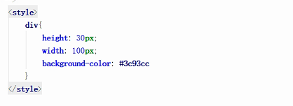
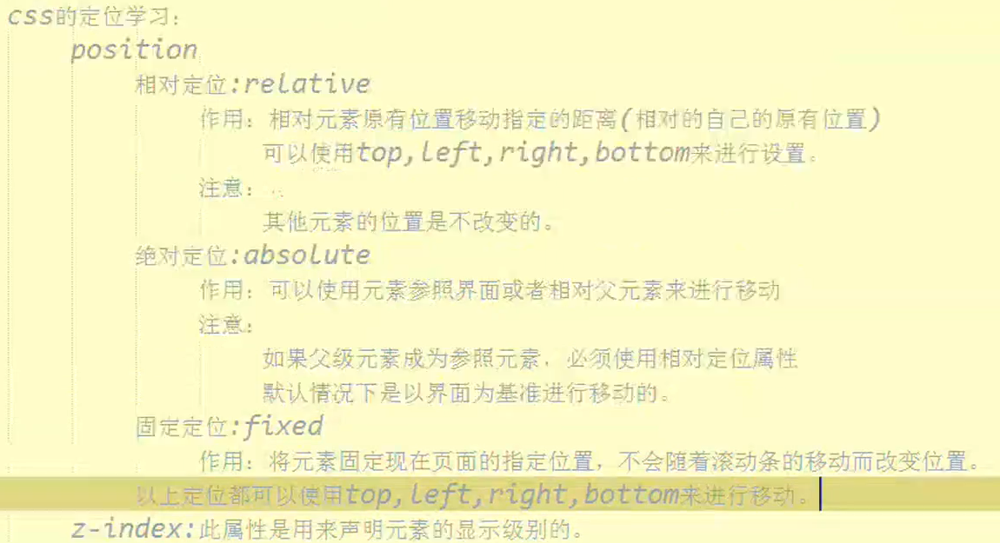

# CSS
## 引入方式
1. 直接在标签上使用style属性设置样式

2. 在head标签内，写一个style标签，在标签内写样式

3. 专门写一个css文件，在html中引入该文件，通过link标签引入

**优先级：1>2>3  
第三种计较常用**

## 基本选择器
1. 标签选择器  
   格式：标签名称{...}
2. 类选择器  
   格式：.类名称{...}  

3. id选择器  
   格式：#id名称{...}  

  
对选中的所有都起作用  
优先级：ID选择器>类选择器>标签选择器

## 扩展选择器
后代选择器
  
子代选择器 选择器1>选择器2{...}  
**只能对直接子代选择**

#类名命名规则  
**不能以数字开头！**

## 盒子模型

## 盒子模型的简单布局div.html

## css的定位

## 设置背景图片适应div的大小使用background-size属性，一般设为cover即可使图片自动适应div的大小。
## 让div充满整个页面
