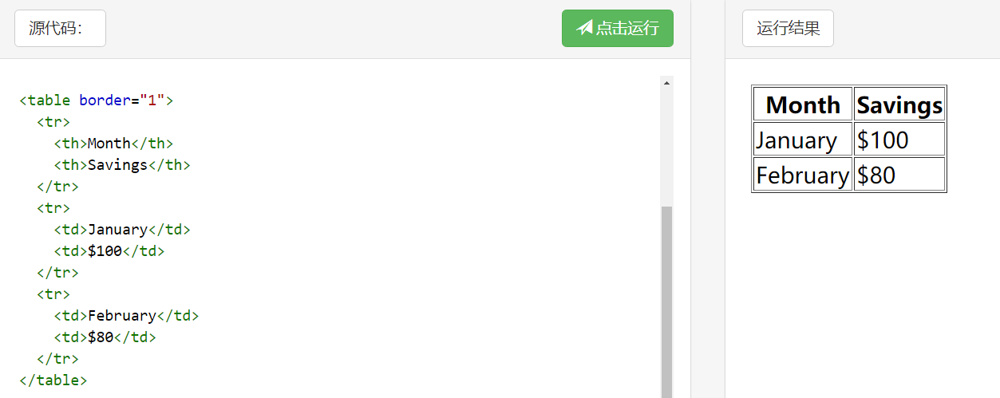
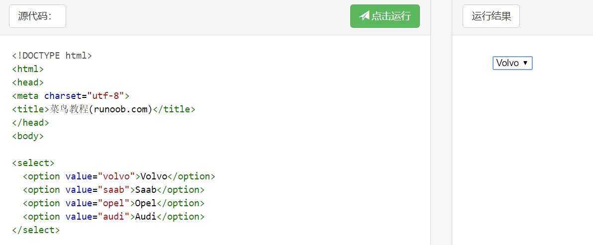
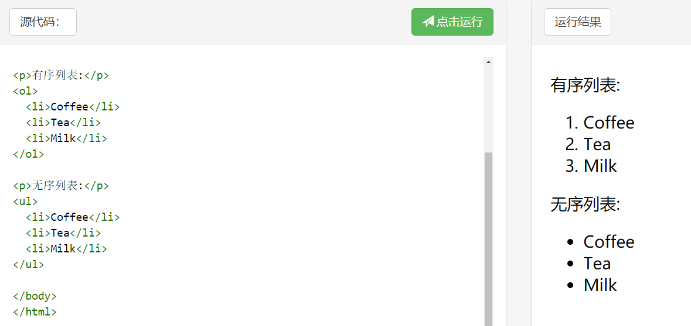
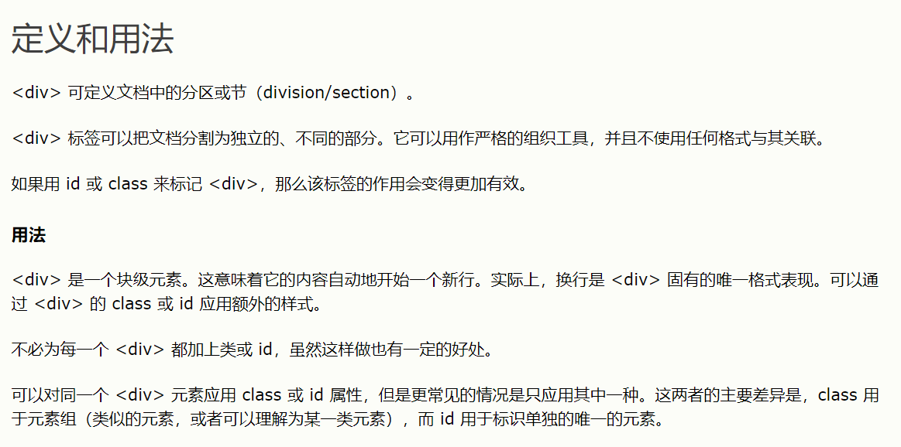
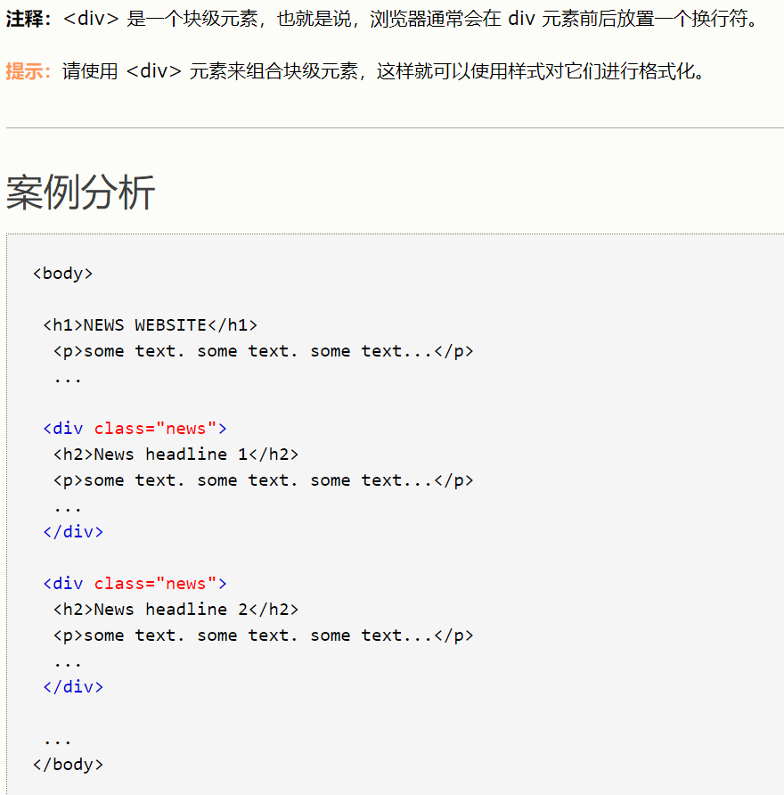
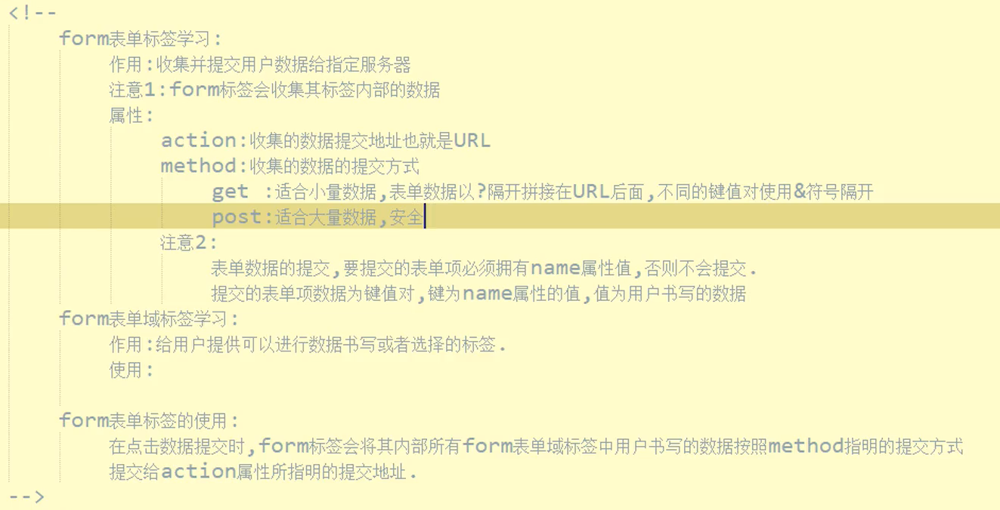
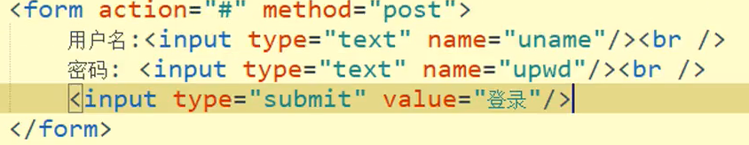
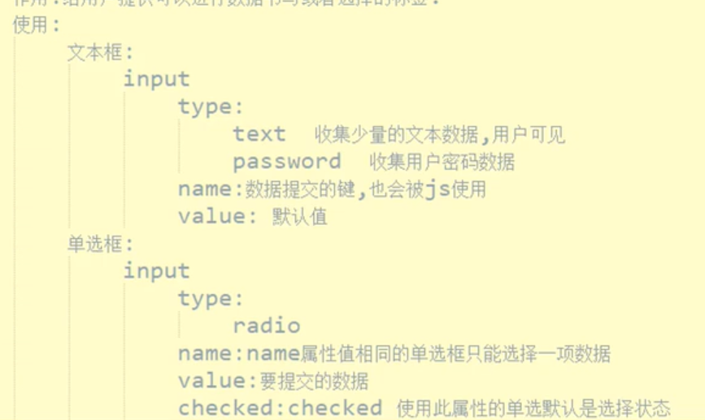

### 7.1  
今天早上搭上了来培训的车，到宿舍之后搬东西、收拾东西，一天下来还蛮累的，感觉环境挺差的，但是学习嘛，要那么好的环境干嘛，这要说差也不会差到哪去，学！  
老师带着我们接触了html，之前有接触过，不过没有学多少，在这做点小笔记。
***

在html中，大部分标签都是成对出现的，一般包括head还有body两大部分  

## `<base>`
`<base href="url" target="_blank">`  
用来规定默认的URL和默认目标。  
这里的默认目标：`_blank`表示用新的页面打开链接，**`_self`表示用原来的页面打开，即覆盖原来在浏览的页面。**

## 表格`<table>`  
1. th表示表头，默认黑体，后接/th
2. tr表示一行，后接/tr
3. td表示单元格，后接/td

  
ul 无序列表  
#表单标签 input
## type
1. 默认type：text：文本框（单行）
2. password（密码输入框）
3. radio：单选框（注意：要指定在同一组，给他们一个相同的name）
4. checkbox：多选框（同上）
5. submit：提交按钮，把表单数据提交到服务器 （value：指定按钮上的文字）
6. reset：重置按钮，把表单还原

## 多选框`<select>`

## 文本框`<textarea>`
rows表示行数，cols表示列数

## `<form>`:表示一个表单
1. action：用来指定表单数据提交的地址，通常是服务器的地址
2. method：指定提交数据的方式
3. restful风格：post（提交数据）、get（获取数据）、put（修改数据）、delete（删除数据）
4. **注意：需要给每个表单标签设置一个name、value**

## 列表
1. `<ol>`有序列表
2. `<ul>`无序列表
3. `<li>`表示一个单元

## `
`（块）
定义文档中的分区  

## 内嵌网页iframe
### 属性
src：要内嵌的网页的地址（绝对路径、相对路径）  
width：宽度（100%，100px）
height：高度（100px）

## 框架frameset
rows按行切 rows="20%,*,10%" 切成2，7，1成  
cols按列切，同理  
然后用frame标签显示要内嵌的东西  
**注意：要将body标签去掉，换成frameset标签**

## form表单标签

## 

**form表单数据的提交需要依赖于submit提交按钮**

