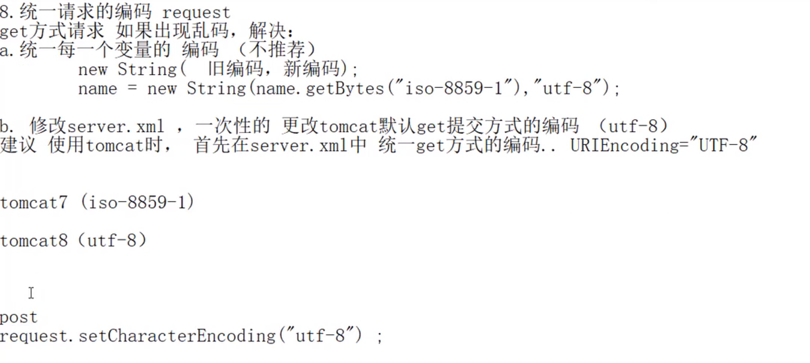
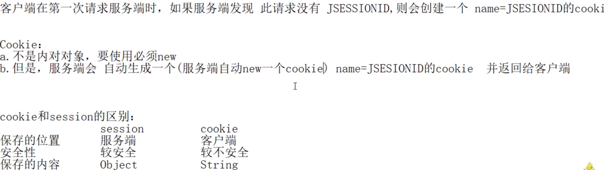
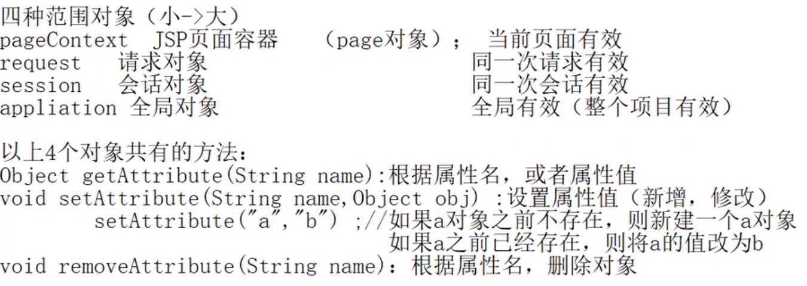

# Eclipse快捷键
## alt+/ 内容提示
## ctrl+alt+下箭头  快速向下复制
## shift+alt+a  块编辑
## shift+alt+L 自动定义变量
## shift+回车键 快速到下一行
## shift+alt+s 菜单对话框  
## ctrl+D 删除光标所在的整行

***
# JavaWeb  
## jsp
可写java代码的html文件  
**jsp->java(servlet文件)->class（可执行文件）**

## 转发与重定向

**转发是request对象的方法，而重定向是response的方法。**
## session对象

注意：1.获取Cookie只能获取所有cookie，即用getCookies（）方法；  
2.添加cookie是在response对象添加，而获取cookies是在request对象获取

**request.getParameter("name")此处的name应该是html中标签的name属性的值，而不是id属性的值**

## application对象

## 四种范围对象

## 数据库

## JavaBean

# 8.3 实战jsp访问数据库
## MVC模式

## Servlet生命周期
