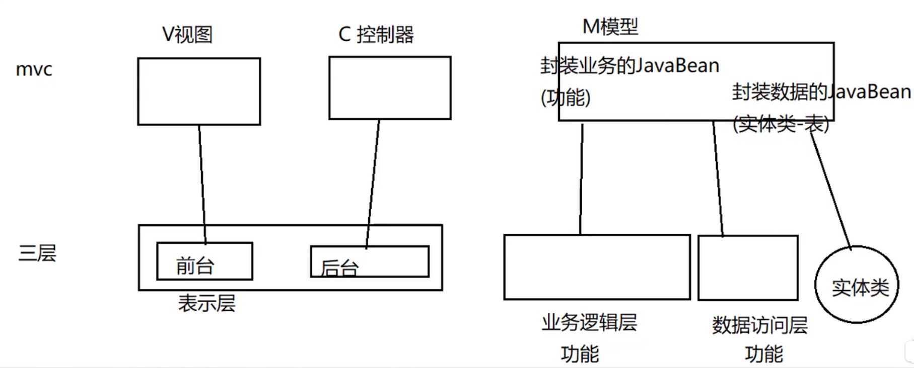
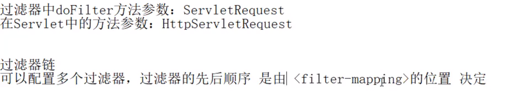

# Eclipse快捷键
## ctrl+shift+c 注释光标所选定行
## alt+/ 内容提示
## ctrl+alt+下箭头  快速向下复制
## shift+alt+a  块编辑
## shift+alt+L 自动定义变量
## shift+回车键 快速到下一行
## shift+alt+s 菜单对话框  
## ctrl+D 删除光标所在的整行

***
# JavaWeb  
## jsp
可写java代码的html文件  
**jsp->java(servlet文件)->class（可执行文件）**


## 转发与重定向


**转发是request对象的方法，而重定向是response的方法。**
## session对象

注意：1.获取Cookie只能获取所有cookie，即用getCookies（）方法；  
2.添加cookie是在response对象添加，而获取cookies是在request对象获取


**request.getParameter("name")此处的name应该是html中标签的name属性的值，而不是id属性的值**

## application对象

## 四种范围对象


## 数据库


## JavaBean

# 8.3 实战jsp访问数据库
## MVC模式


## Servlet生命周期


## Servlet总结：在Eclipse中的src创建一个Servlet，然后重写doGet（），doPost（）即可（doGet（），doPost（）只需写一个，另一个调用该方法即可）
**MVC案例**

## 三层架构


## MVC与三层架构的关系

# 8.6三层架构实战
**Student student=null;此处声明student类的时候必须声明为null，而不是new Student（），否则return的student将会是空的！**  
**int b=Integer.parseInt（String a）将字符a转为整形b**
## Debug

点击最左边 可跳过所有断点，相当于正常模式执行
### 双击行数前面设置断点
### F6单步执行
### F8单步跳过

## 代码优化

**DBUtil(通用数据库帮助类)：提取相同的代码，减少代码量，减少代码冗余，简化Dao层的代码量，一般写在xxx.Util包中**。
## 乱码问题--解决方法

## 文件上传与下载

 
### 下载文件名乱码问题

## EL表达式


## JSTL


  
迭代标签<c: foreach>
```<c: foreach begin="0" end="5" step="1">  
	从0到5依次加一 共执行6次
</c: foreach>```

## 过滤器



## 监听器

### session的四种状态（绑定、解绑、钝化、活化）


### 钝化配置
    <Manager classname="org.apache.catalina.session.PersistentManager" maxIdleSwap="3">//三秒不操作则进行钝化操作，将session从内存存到硬盘MB目录中
    	<Store classname="org.apache.catalina.session.FileStore" directory="MB"/>
    </Manager>
## Ajax
**异步刷新js和xml**  
**异步刷新：如果一个网页中只有某个地方需要修改（百度搜索栏提示/视频点赞等），异步刷新可以使得网页只有一部分被修改，而其他地方不变，不需要刷新整个页面。**


实战：phone.jsp PhoneServlet.java


