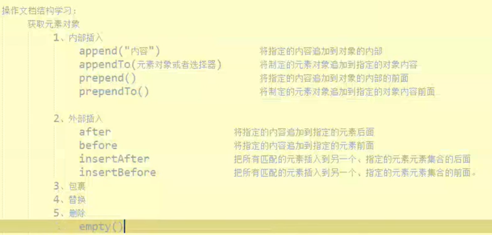
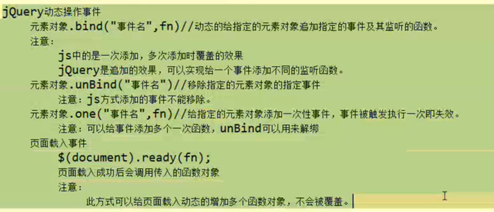
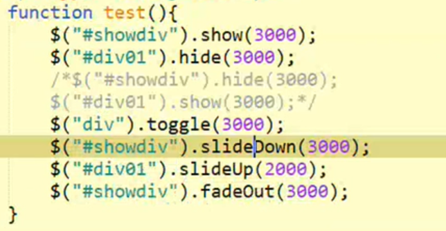

# JQuery

---

## 选择器

## 操作元素属性

**类似于js的getattribute（）和setattribute（）**
## 操作元素内容
 
## 操作元素样式

## 操作文档结构

## 动态操作事件

## 动画
  
**3000表示3000毫秒（即在3秒内完成该动画）  
显示隐藏的元素内容  
隐藏显示的元素内容  
若是显示则改为隐藏，若是隐藏则改为显示  
向下滑行  
向上滑行  
淡出  
淡入为fadeIn（）**