# Javascript
## 数据类型  
string、Number(包括整数和浮点数)、date
## 定义变量

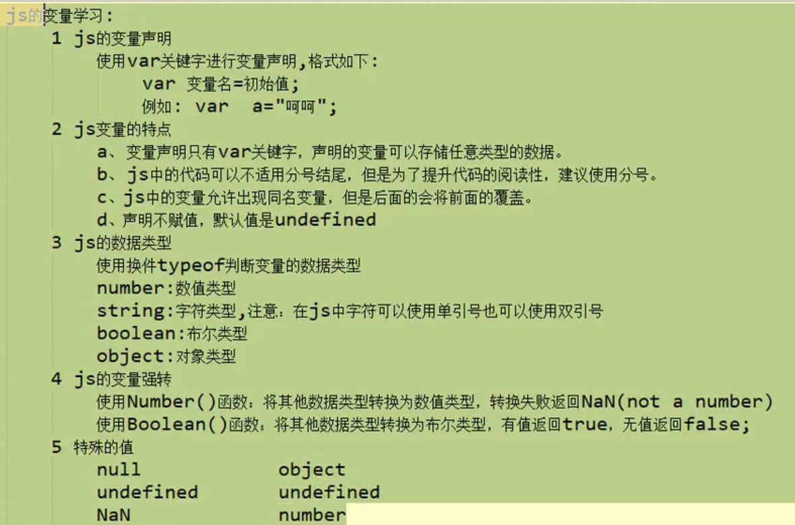

**类型强转时，Boolean（）函数，对于非0值则转为true，对于0还有未赋值的则转为false**

var aaa；var可以定义任何变量  
aaa=24；  
**所有变量都用var定义**
## 定义方法
function 方法名称（a,b,c）{  
*当需要返回数据时，直接return即可；  
不需要返回数据则不写return*  
}  
*参数列表因为都是var类型，所以可以省略不写，只写变量名即可*  
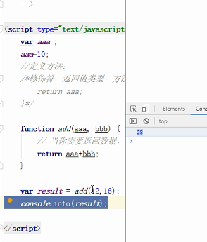  
alert();//弹窗
## 数组
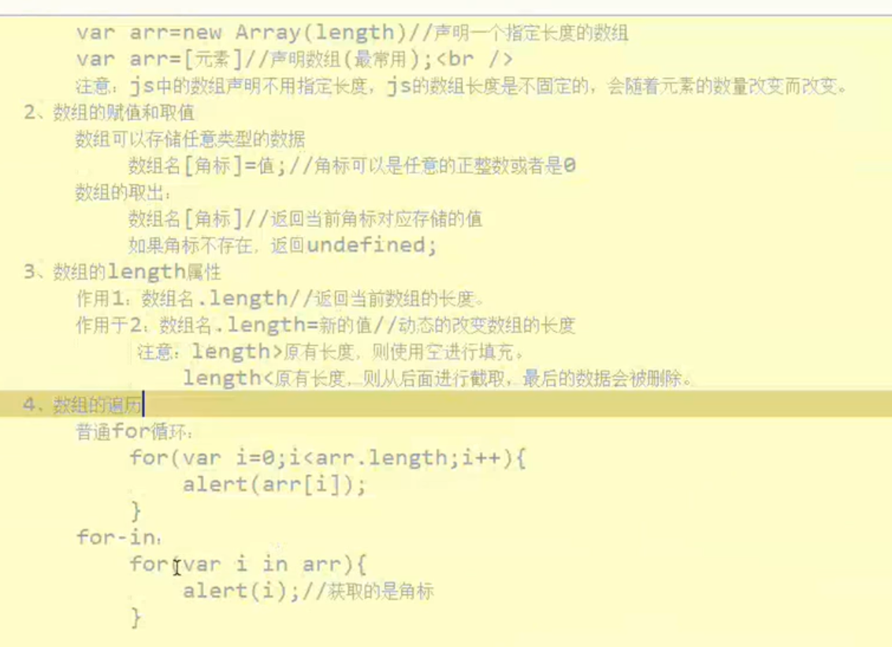
**常用操作**
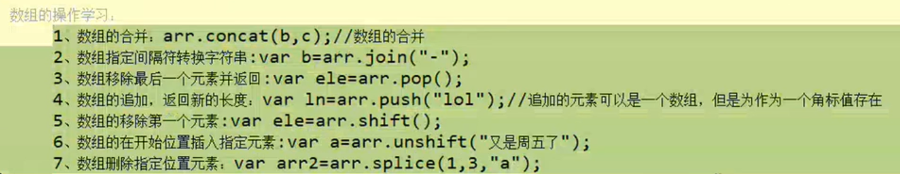
## 函数
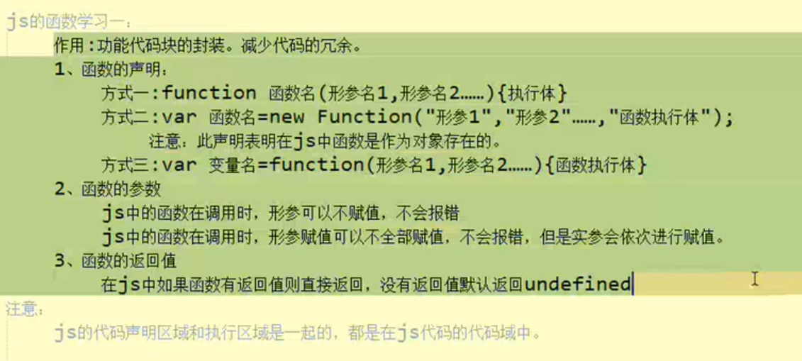
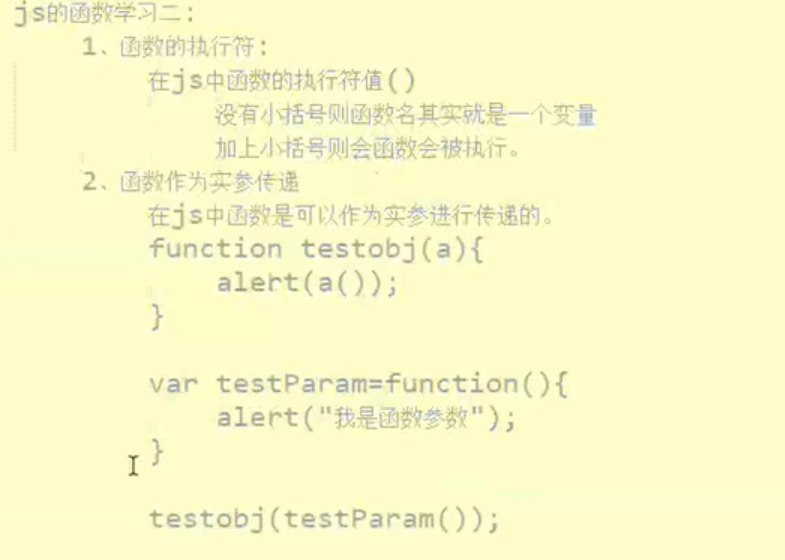
## 类
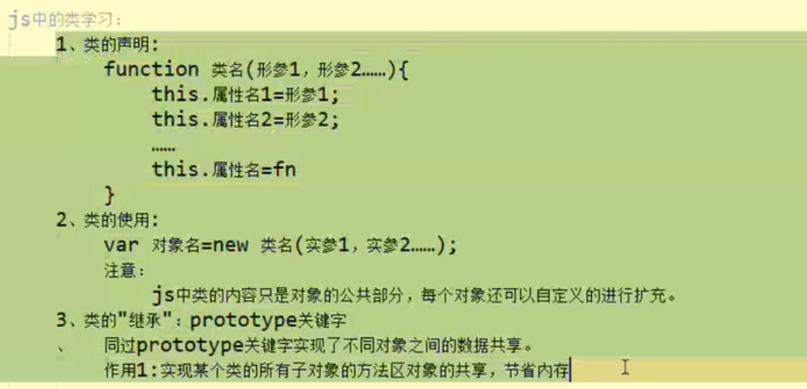
## 自定义对象
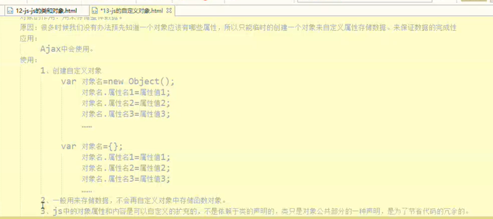
## 事件机制
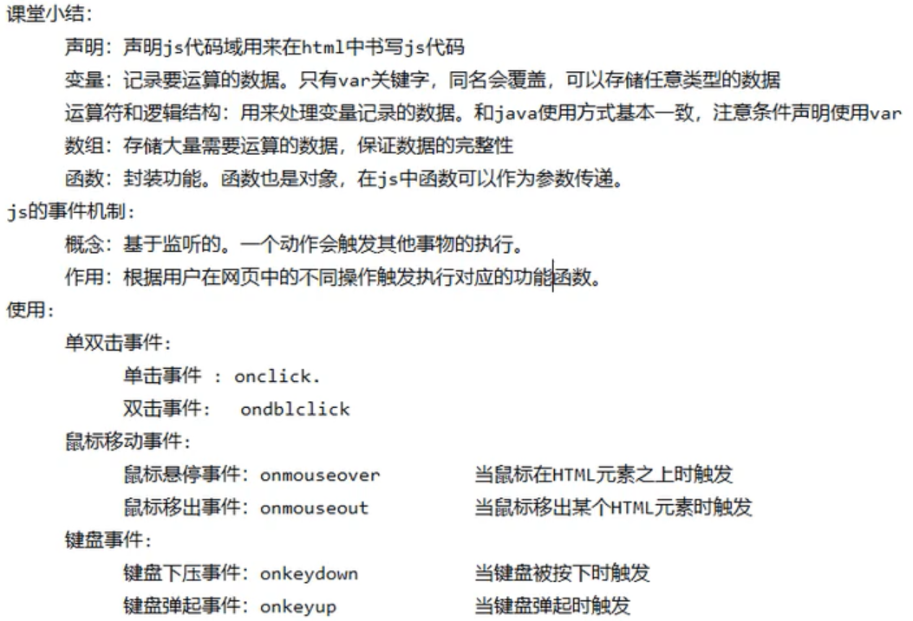

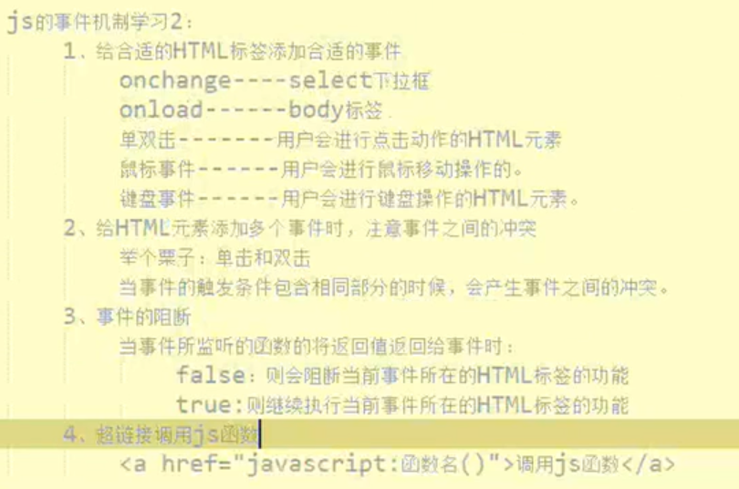
## 常用对象及其常用方法
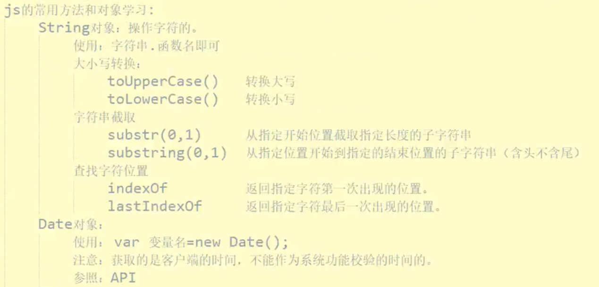
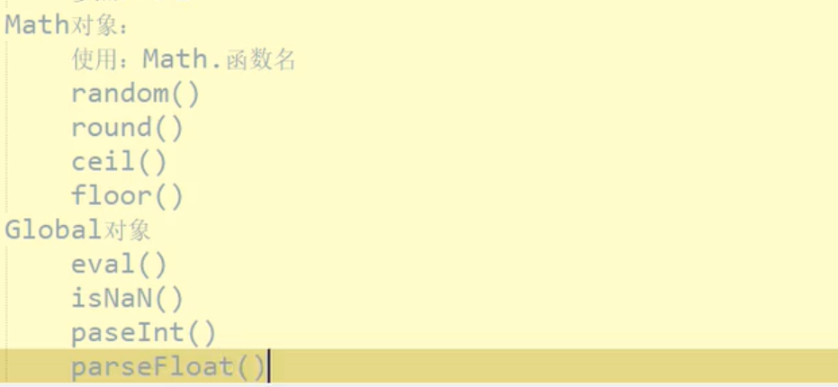
## window对象
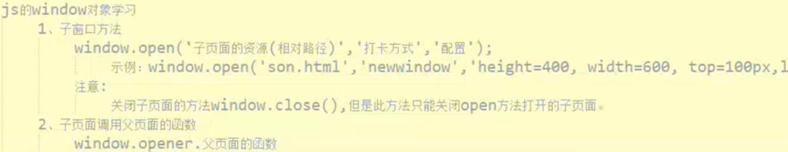
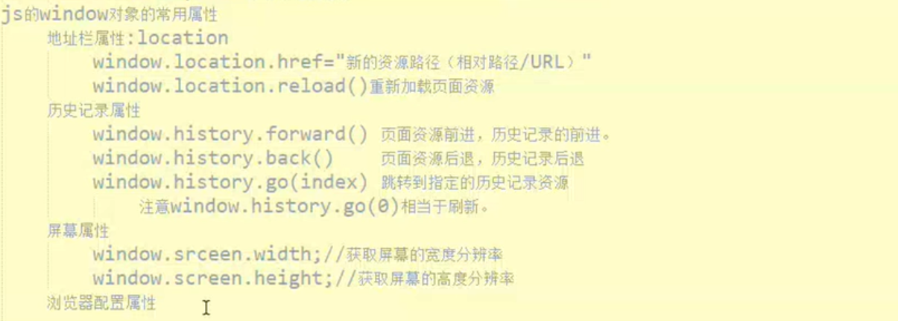
浏览器配置属性**window.navigator.userAgent**
## document对象
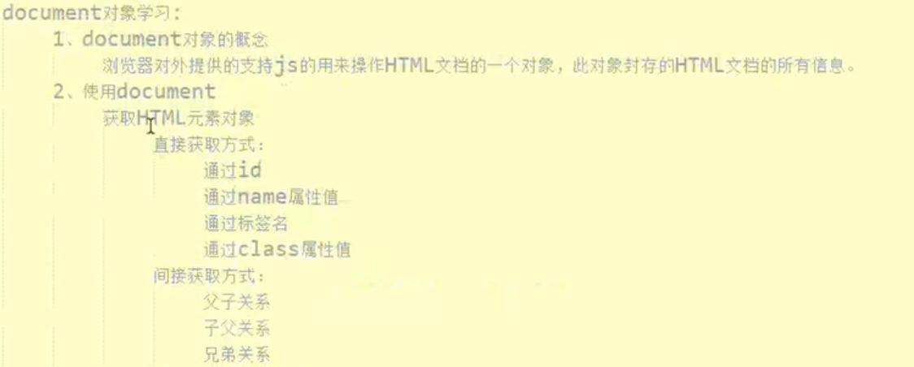
