# MySQL
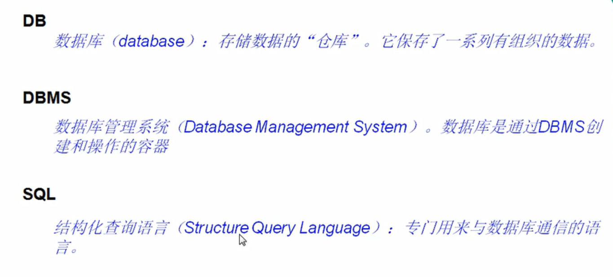
## 数据库存储数据的特点
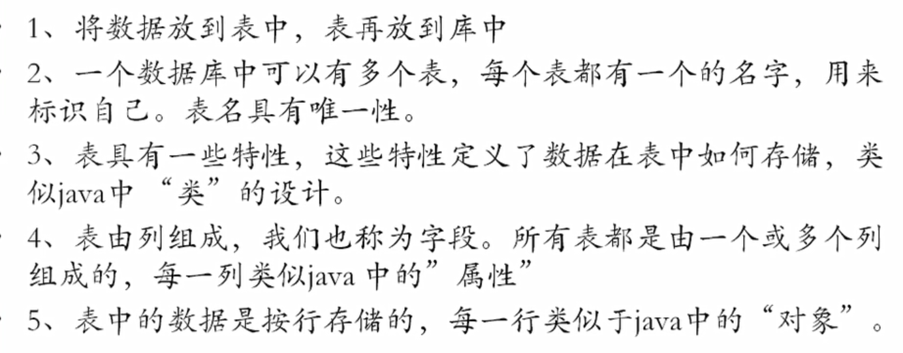
## mysql服务的启动与停止

## mysql服务的登录与退出
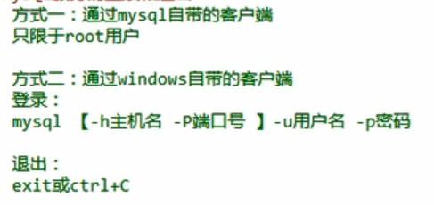
## mysql的常见命令
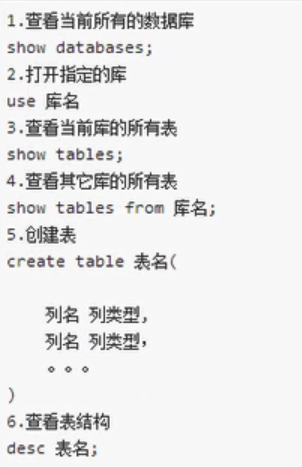
## mysql的语法规范

## 基础查询
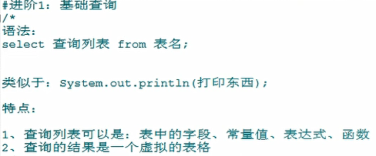
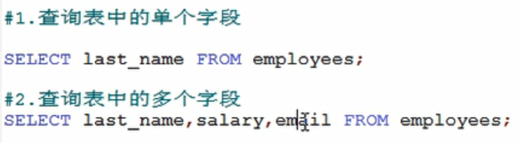
查询表中的所有字段  

### 起别名
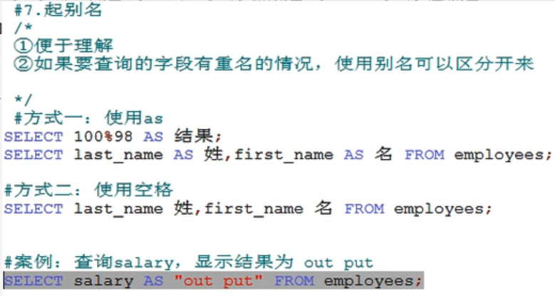
### 去重
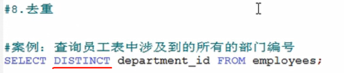
### +号的作用
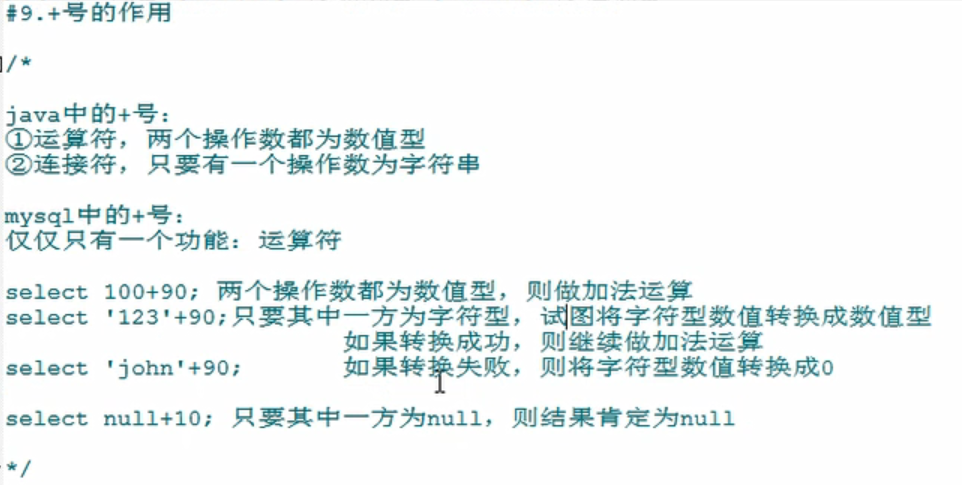
### 拼接
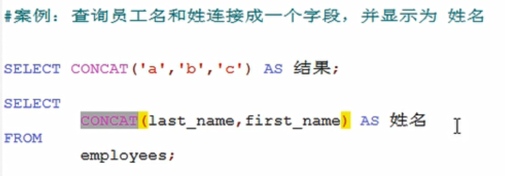
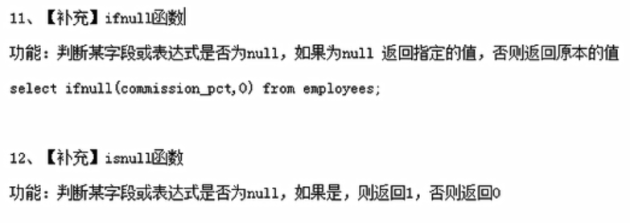
## 条件查询

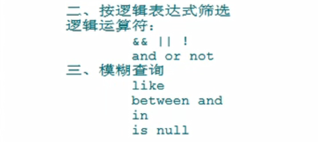

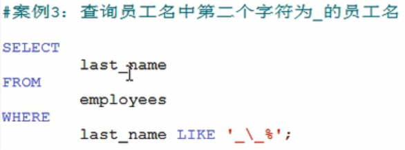**\表示转义**
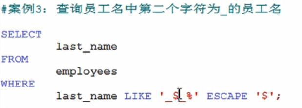**ESCAPE表示后面的字符为转义字符**  
  
`字符串要用''包含起来 ""也可以`  
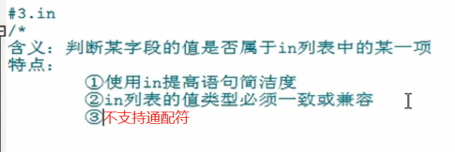
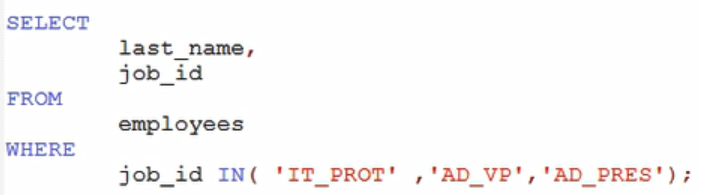
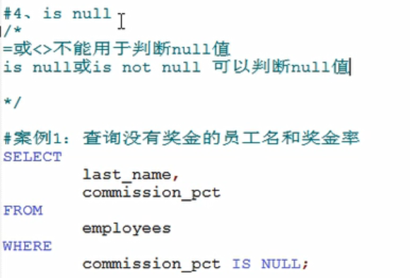
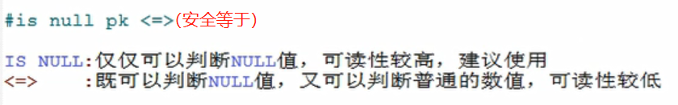
## 排序查询
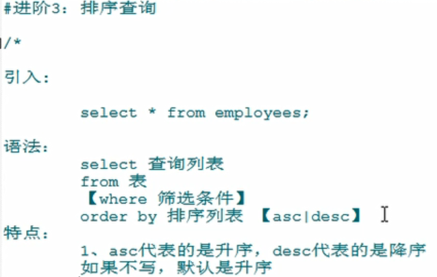
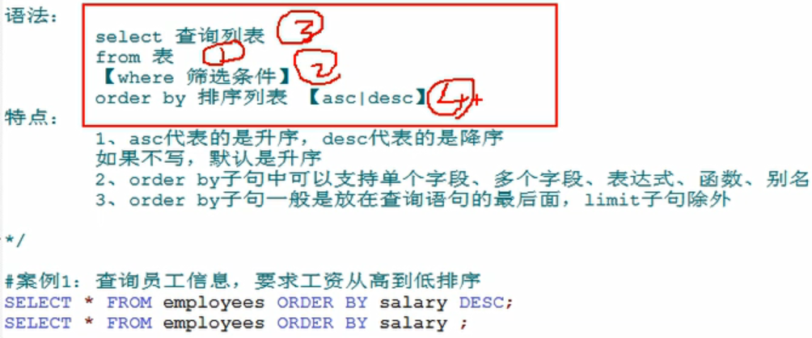

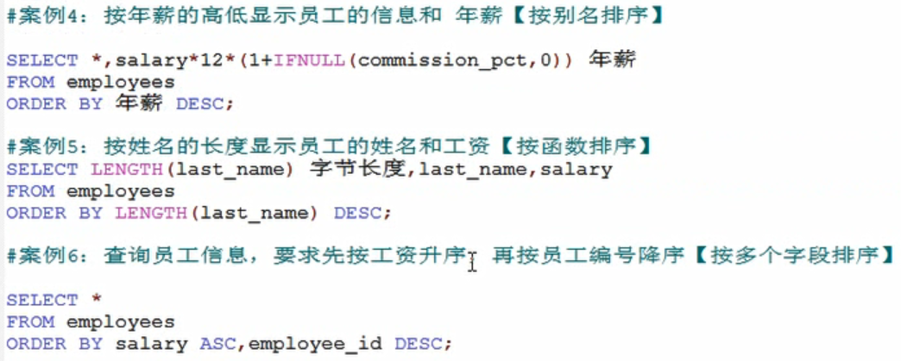
### 案例
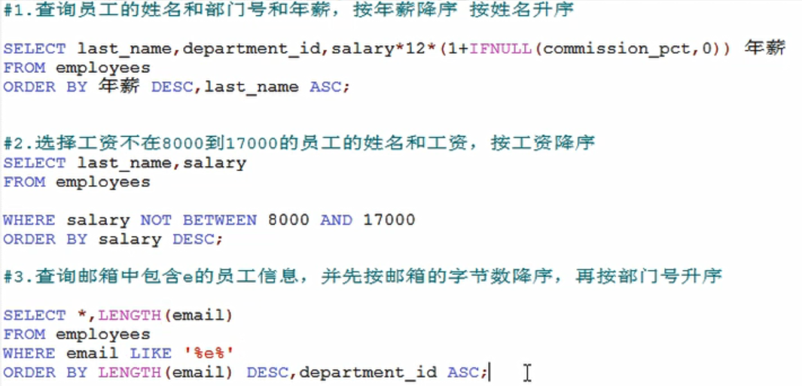
## 常见函数
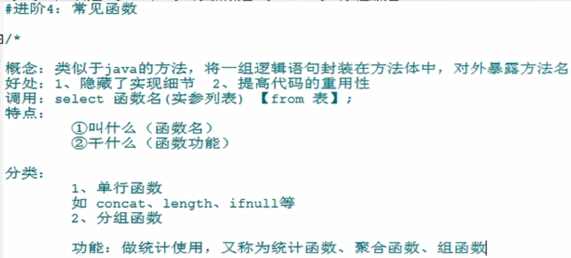
## 单行函数
### 字符函数
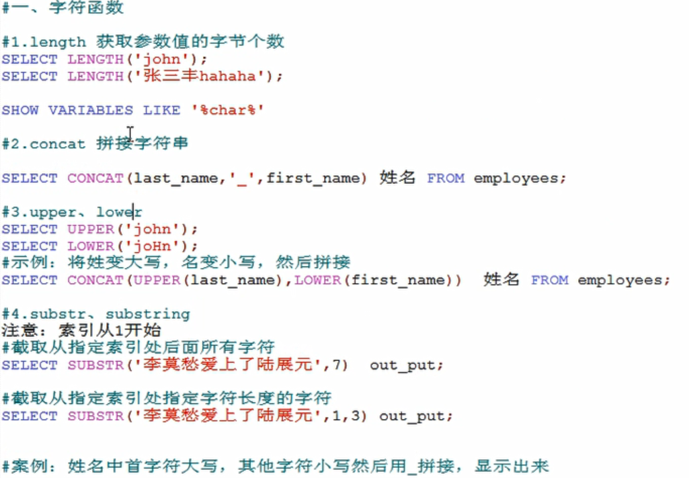
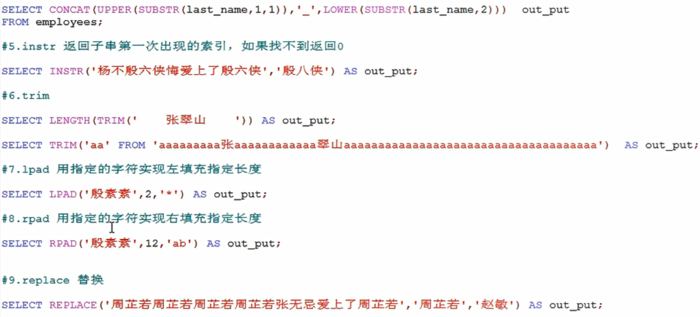
### 数学函数
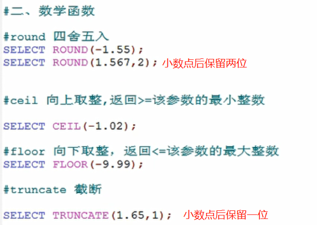
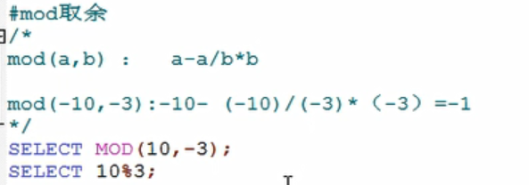
### 日期函数

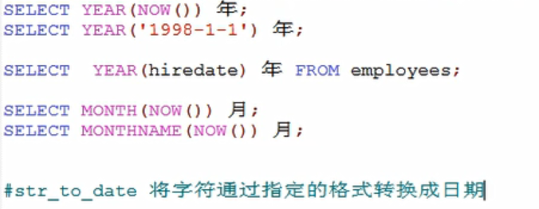
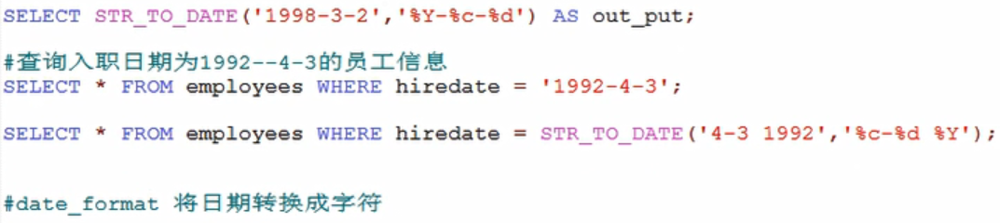

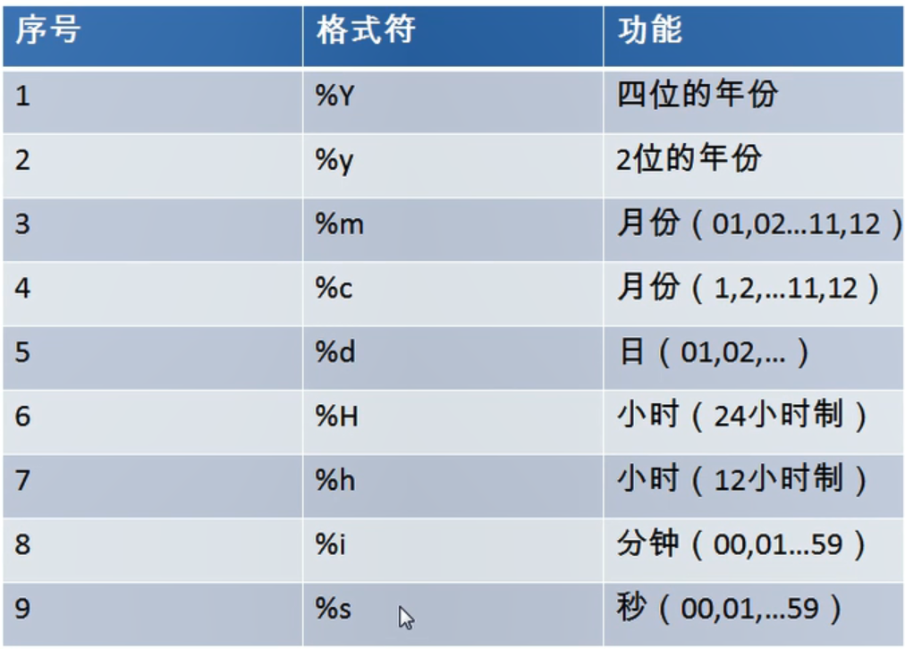
### 其他函数

### 流程控制函数
1.if函数： if else 的效果

    SELECT IF(10<5,'大','小');
    
    SELECT last_name,commission_pct,IF(commission_pct IS NULL,'没奖金，呵呵','有奖金，嘻嘻') 备注
    FROM employees;  
2.case函数的使用一： switch case 的效果

    java中
    switch(变量或表达式){
    	case 常量1：语句1;break;
    	...
    	default:语句n;break;
    
    
    }
    
    mysql中
    
    case 要判断的字段或表达式
    when 常量1 then 要显示的值1或语句1;
    when 常量2 then 要显示的值2或语句2;
    ...
    else 要显示的值n或语句n;
    end
    /*案例：查询员工的工资，要求

    部门号=30，显示的工资为1.1倍
    部门号=40，显示的工资为1.2倍
    部门号=50，显示的工资为1.3倍
    其他部门，显示的工资为原工资
    
    */
    
    
    SELECT salary 原始工资,department_id,
    CASE department_id
    WHEN 30 THEN salary*1.1
    WHEN 40 THEN salary*1.2
    WHEN 50 THEN salary*1.3
    ELSE salary
    END AS 新工资
    FROM employees;
    
    
    
   #3.case 函数的使用二：类似于 多重if

    /*
    java中：
    if(条件1){
    	语句1；
    }else if(条件2){
    	语句2；
    }
    ...
    else{
    	语句n;
    }
    
    mysql中：
    
    case 
    when 条件1 then 要显示的值1或语句1
    when 条件2 then 要显示的值2或语句2
    。。。
    else 要显示的值n或语句n
    end
    */
    
    #案例：查询员工的工资的情况
    如果工资>20000,显示A级别
    如果工资>15000,显示B级别
    如果工资>10000，显示C级别
    否则，显示D级别
    
    
    SELECT salary,
    CASE 
    WHEN salary>20000 THEN 'A'
    WHEN salary>15000 THEN 'B'
    WHEN salary>10000 THEN 'C'
    ELSE 'D'
    END AS 工资级别
    FROM employees;
## 分组函数
    二、分组函数
    /*
    功能：用作统计使用，又称为聚合函数或统计函数或组函数
    
    分类：
    sum 求和、avg 平均值、max 最大值 、min 最小值 、count 计算个数
    
    特点：
    1、sum、avg一般用于处理数值型
       max、min、count可以处理任何类型
    2、以上分组函数都忽略null值
    
    3、可以和distinct搭配实现去重的运算
    
    4、count函数的单独介绍
    一般使用count(*)用作统计行数
    
    5、和分组函数一同查询的字段要求是group by后的字段
    
    */
    
    
    #1、简单 的使用
    SELECT SUM(salary) FROM employees;
    SELECT AVG(salary) FROM employees;
    SELECT MIN(salary) FROM employees;
    SELECT MAX(salary) FROM employees;
    SELECT COUNT(salary) FROM employees;
    
    
    SELECT SUM(salary) 和,AVG(salary) 平均,MAX(salary) 最高,MIN(salary) 最低,COUNT(salary) 个数
    FROM employees;
    
    SELECT SUM(salary) 和,ROUND(AVG(salary),2) 平均,MAX(salary) 最高,MIN(salary) 最低,COUNT(salary) 个数
    FROM employees;
    #2、参数支持哪些类型

    SELECT SUM(last_name) ,AVG(last_name) FROM employees;
    SELECT SUM(hiredate) ,AVG(hiredate) FROM employees;
    
    SELECT MAX(last_name),MIN(last_name) FROM employees;
    
    SELECT MAX(hiredate),MIN(hiredate) FROM employees;
    
    SELECT COUNT(commission_pct) FROM employees;
    SELECT COUNT(last_name) FROM employees;
    
    #3、是否忽略null
    
    SELECT SUM(commission_pct) ,AVG(commission_pct),SUM(commission_pct)/35,SUM(commission_pct)/107 FROM employees;
    
    SELECT MAX(commission_pct) ,MIN(commission_pct) FROM employees;
    
    SELECT COUNT(commission_pct) FROM employees;
    SELECT commission_pct FROM employees;
    
    
    #4、和distinct搭配
    
    SELECT SUM(DISTINCT salary),SUM(salary) FROM employees;
    
    SELECT COUNT(DISTINCT salary),COUNT(salary) FROM employees;
    
    
    
    #5、count函数的详细介绍
    
    SELECT COUNT(salary) FROM employees;
    
    
    SELECT COUNT(*) FROM employees;
    
    SELECT COUNT(1) FROM employees;
    
    效率：
    MYISAM存储引擎下  ，COUNT(*)的效率高
    INNODB存储引擎下，COUNT(*)和COUNT(1)的效率差不多，比COUNT(字段)要高一些
    
    
    #6、和分组函数一同查询的字段有限制
    
    SELECT AVG(salary),employee_id  FROM employees;

