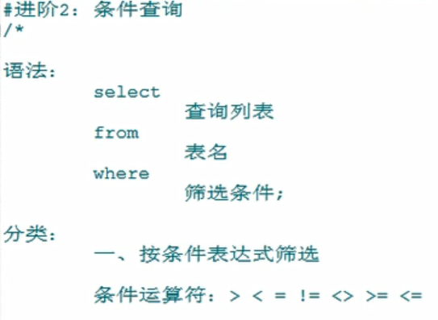
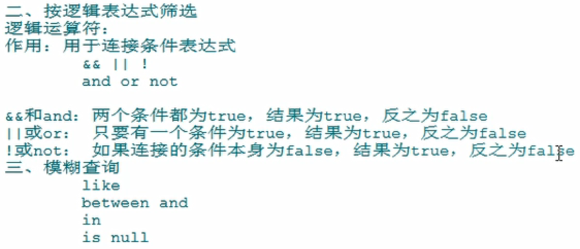

# MySQL

## 数据库存储数据的特点

## mysql服务的启动与停止

## mysql服务的登录与退出

## mysql的常见命令

## mysql的语法规范

## 基础查询

查询表中的所有字段  

### 起别名

### 去重

### +号的作用

### 拼接

## 条件查询

**\表示转义**
**ESCAPE表示后面的字符为转义字符**  
  
`字符串要用''包含起来 ""也可以`  

## 排序查询

### 案例

## 常见函数

## 单行函数
### 字符函数

### 数学函数

### 日期函数

### 其他函数

### 流程控制函数
1.if函数： if else 的效果

    SELECT IF(10<5,'大','小');
    
    SELECT last_name,commission_pct,IF(commission_pct IS NULL,'没奖金，呵呵','有奖金，嘻嘻') 备注
    FROM employees;  
2.case函数的使用一： switch case 的效果

    java中
    switch(变量或表达式){
    	case 常量1：语句1;break;
    	...
    	default:语句n;break;
    
    
    }
    
    mysql中
    
    case 要判断的字段或表达式
    when 常量1 then 要显示的值1或语句1;
    when 常量2 then 要显示的值2或语句2;
    ...
    else 要显示的值n或语句n;
    end
    /*案例：查询员工的工资，要求

    部门号=30，显示的工资为1.1倍
    部门号=40，显示的工资为1.2倍
    部门号=50，显示的工资为1.3倍
    其他部门，显示的工资为原工资
    
    */
    
    
    SELECT salary 原始工资,department_id,
    CASE department_id
    WHEN 30 THEN salary*1.1
    WHEN 40 THEN salary*1.2
    WHEN 50 THEN salary*1.3
    ELSE salary
    END AS 新工资
    FROM employees;
    
    
    
   #3.case 函数的使用二：类似于 多重if

    /*
    java中：
    if(条件1){
    	语句1；
    }else if(条件2){
    	语句2；
    }
    ...
    else{
    	语句n;
    }
    
    mysql中：
    
    case 
    when 条件1 then 要显示的值1或语句1
    when 条件2 then 要显示的值2或语句2
    。。。
    else 要显示的值n或语句n
    end
    */
    
    #案例：查询员工的工资的情况
    如果工资>20000,显示A级别
    如果工资>15000,显示B级别
    如果工资>10000，显示C级别
    否则，显示D级别
    
    
    SELECT salary,
    CASE 
    WHEN salary>20000 THEN 'A'
    WHEN salary>15000 THEN 'B'
    WHEN salary>10000 THEN 'C'
    ELSE 'D'
    END AS 工资级别
    FROM employees;
## 分组函数
    二、分组函数
    /*
    功能：用作统计使用，又称为聚合函数或统计函数或组函数
    
    分类：
    sum 求和、avg 平均值、max 最大值 、min 最小值 、count 计算个数
    
    特点：
    1、sum、avg一般用于处理数值型
       max、min、count可以处理任何类型
    2、以上分组函数都忽略null值
    
    3、可以和distinct搭配实现去重的运算
    
    4、count函数的单独介绍
    一般使用count(*)用作统计行数
    
    5、和分组函数一同查询的字段要求是group by后的字段
    
    */
    
    
    #1、简单 的使用
    SELECT SUM(salary) FROM employees;
    SELECT AVG(salary) FROM employees;
    SELECT MIN(salary) FROM employees;
    SELECT MAX(salary) FROM employees;
    SELECT COUNT(salary) FROM employees;
    
    
    SELECT SUM(salary) 和,AVG(salary) 平均,MAX(salary) 最高,MIN(salary) 最低,COUNT(salary) 个数
    FROM employees;
    
    SELECT SUM(salary) 和,ROUND(AVG(salary),2) 平均,MAX(salary) 最高,MIN(salary) 最低,COUNT(salary) 个数
    FROM employees;
    #2、参数支持哪些类型

    SELECT SUM(last_name) ,AVG(last_name) FROM employees;
    SELECT SUM(hiredate) ,AVG(hiredate) FROM employees;
    
    SELECT MAX(last_name),MIN(last_name) FROM employees;
    
    SELECT MAX(hiredate),MIN(hiredate) FROM employees;
    
    SELECT COUNT(commission_pct) FROM employees;
    SELECT COUNT(last_name) FROM employees;
    
    #3、是否忽略null
    
    SELECT SUM(commission_pct) ,AVG(commission_pct),SUM(commission_pct)/35,SUM(commission_pct)/107 FROM employees;
    
    SELECT MAX(commission_pct) ,MIN(commission_pct) FROM employees;
    
    SELECT COUNT(commission_pct) FROM employees;
    SELECT commission_pct FROM employees;
    
    
    #4、和distinct搭配
    
    SELECT SUM(DISTINCT salary),SUM(salary) FROM employees;
    
    SELECT COUNT(DISTINCT salary),COUNT(salary) FROM employees;
    
    
    
    #5、count函数的详细介绍
    
    SELECT COUNT(salary) FROM employees;
    
    
    SELECT COUNT(*) FROM employees;
    
    SELECT COUNT(1) FROM employees;//与count（*）一致都可以统计行数
    
    效率：
    MYISAM存储引擎下  ，COUNT(*)的效率高
    INNODB存储引擎下，COUNT(*)和COUNT(1)的效率差不多，比COUNT(字段)要高一些
    
    
    #6、和分组函数一同查询的字段有限制
    
    SELECT AVG(salary),employee_id  FROM employees;//不这样使用，一个是分组函数，一个是单行函数！
## 分组查询
    进阶5：分组查询
    /*
    语法：
    select 查询列表
    from 表
    【where 筛选条件】
    group by 分组的字段
    【order by 排序的字段】;
    
    特点：
    1、和分组函数一同查询的字段必须是group by后出现的字段
    2、筛选分为两类：分组前筛选和分组后筛选
    		针对的表			位置		连接的关键字
    分组前筛选	原始表				group by前	where
    	
    分组后筛选	group by后的结果集		group by后	having
    
    问题1：分组函数做筛选能不能放在where后面
    答：不能
    
    问题2：where——group by——having
    
    一般来讲，能用分组前筛选的，尽量使用分组前筛选，提高效率
    
    3、分组可以按单个字段也可以按多个字段
    4、可以搭配着排序使用
    */
    #引入：查询每个部门的员工个数
    
    SELECT COUNT(*) FROM employees WHERE department_id=90;
    #1.简单的分组
    
    #案例1：查询每个工种的员工平均工资
    SELECT AVG(salary),job_id
    FROM employees
    GROUP BY job_id;
    
    #案例2：查询每个位置的部门个数
    
    SELECT COUNT(*),location_id
    FROM departments
    GROUP BY location_id;
    2、可以实现分组前的筛选
    
    #案例1：查询邮箱中包含a字符的 每个部门的最高工资
    
    SELECT MAX(salary),department_id
    FROM employees
    WHERE email LIKE '%a%'
    GROUP BY department_id;
    
    #案例2：查询有奖金的每个领导手下员工的平均工资
    
    SELECT AVG(salary),manager_id
    FROM employees
    WHERE commission_pct IS NOT NULL
    GROUP BY manager_id;
    
    #3、分组后筛选
    
    #案例：查询哪个部门的员工个数>5
    
    #①查询每个部门的员工个数
    SELECT COUNT(*),department_id
    FROM employees
    GROUP BY department_id;
    
    #② 筛选刚才①结果
    
    SELECT COUNT(*),department_id
    FROM employees
    
    GROUP BY department_id
    
    HAVING COUNT(*)>5;
    
    #案例2：每个工种有奖金的员工的最高工资>12000的工种编号和最高工资
    
    SELECT job_id,MAX(salary)
    FROM employees
    WHERE commission_pct IS NOT NULL
    GROUP BY job_id
    HAVING MAX(salary)>12000;
    
    #案例3：领导编号>102的每个领导手下的最低工资大于5000的领导编号和最低工资
    
    manager_id>102
    
    SELECT manager_id,MIN(salary)
    FROM employees
    GROUP BY manager_id
    HAVING MIN(salary)>5000;
    #4.添加排序
    
    #案例：每个工种有奖金的员工的最高工资>6000的工种编号和最高工资,按最高工资升序
    
    SELECT job_id,MAX(salary) m
    FROM employees
    WHERE commission_pct IS NOT NULL
    GROUP BY job_id
    HAVING m>6000
    ORDER BY m ;
    
    #5.按多个字段分组
    
    #案例：查询每个工种每个部门的最低工资,并按最低工资降序
    
    SELECT MIN(salary),job_id,department_id
    FROM employees
    GROUP BY department_id,job_id
    ORDER BY MIN(salary) DESC;
## 连接查询
    #进阶6：连接查询
    含义：又称多表查询，当查询的字段来自于多个表时，就会用到连接查询
    
    笛卡尔乘积现象：表1 有m行，表2有n行，结果=m*n行
    
    发生原因：没有有效的连接条件
    如何避免：添加有效的连接条件
    
    分类：
	按年代分类：
	sql92标准:仅仅支持内连接
	sql99标准【推荐】：支持内连接+外连接（左外和右外）+交叉连接
	
	按功能分类：
		内连接：
			等值连接
			非等值连接
			自连接
		外连接：
			左外连接
			右外连接
			全外连接
		
		交叉连接
    #一、sql92标准
    #1、等值连接
    /*
    
    ① 多表等值连接的结果为多表的交集部分
    ②n表连接，至少需要n-1个连接条件
    ③ 多表的顺序没有要求
    ④一般需要为表起别名
    ⑤可以搭配前面介绍的所有子句使用，比如排序、分组、筛选
    
    
    */
    
    
    
    #案例1：查询女神名和对应的男神名
    SELECT NAME,boyName 
    FROM boys,beauty
    WHERE beauty.boyfriend_id= boys.id;
    
    #案例2：查询员工名和对应的部门名
    
    SELECT last_name,department_name
    FROM employees,departments
    WHERE employees.`department_id`=departments.`department_id`;
    
    
    
    #2、为表起别名
    /*
    ①提高语句的简洁度
    ②区分多个重名的字段
    
    注意：如果为表起了别名，则查询的字段就不能使用原来的表名去限定
    
    */
    #查询员工名、工种号、工种名
    
    SELECT e.last_name,e.job_id,j.job_title
    FROM employees  e,jobs j
    WHERE e.`job_id`=j.`job_id`;
    
    #3、两个表的顺序是否可以调换
    
    #查询员工名、工种号、工种名
    
    SELECT e.last_name,e.job_id,j.job_title
    FROM jobs j,employees e
    WHERE e.`job_id`=j.`job_id`;
        
    #4、可以加筛选
    
    #案例：查询有奖金的员工名、部门名
    
    SELECT last_name,department_name,commission_pct
    
    FROM employees e,departments d
    WHERE e.`department_id`=d.`department_id`
    AND e.`commission_pct` IS NOT NULL;
    
    #案例2：查询城市名中第二个字符为o的部门名和城市名
    
    SELECT department_name,city
    FROM departments d,locations l
    WHERE d.`location_id` = l.`location_id`
    AND city LIKE '_o%';
    
    #5、可以加分组

    #案例1：查询每个城市的部门个数
    
    SELECT COUNT(*) 个数,city
    FROM departments d,locations l
    WHERE d.`location_id`=l.`location_id`
    GROUP BY city;
    
    #案例2：查询有奖金的每个部门的部门名和部门的领导编号和该部门的最低工资
    SELECT department_name,d.`manager_id`,MIN(salary)
    FROM departments d,employees e
    WHERE d.`department_id`=e.`department_id`
    AND commission_pct IS NOT NULL
    GROUP BY department_name,d.`manager_id`;
    #6、可以加排序
    
    #案例：查询每个工种的工种名和员工的个数，并且按员工个数降序
    
    SELECT job_title,COUNT(*)
    FROM employees e,jobs j
    WHERE e.`job_id`=j.`job_id`
    GROUP BY job_title
    ORDER BY COUNT(*) DESC;
    
    #7、可以实现三表连接？
    
    #案例：查询员工名、部门名和所在的城市
    
    SELECT last_name,department_name,city
    FROM employees e,departments d,locations l
    WHERE e.`department_id`=d.`department_id`
    AND d.`location_id`=l.`location_id`
    AND city LIKE 's%'
    
    ORDER BY department_name DESC;
    #2、非等值连接
    
    #案例1：查询员工的工资和工资级别
    
    SELECT salary,grade_level
    FROM employees e,job_grades g
    WHERE salary BETWEEN g.`lowest_sal` AND g.`highest_sal`
    AND g.`grade_level`='A';
    
    #3、自连接
    
    
    #案例：查询 员工名和上级的名称
    
    SELECT e.employee_id,e.last_name,m.employee_id,m.last_name
    FROM employees e,employees m
    WHERE e.`manager_id`=m.`employee_id`;
    
    
