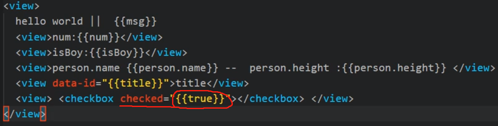
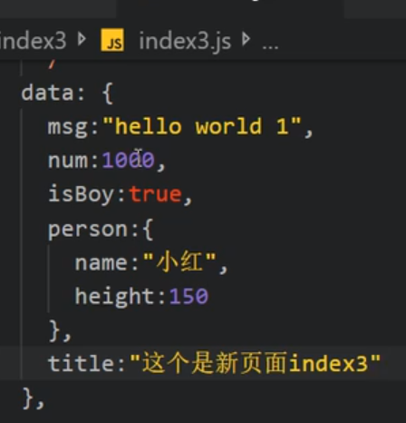
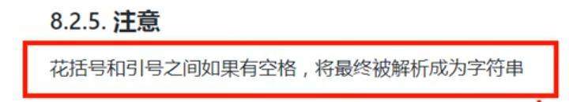
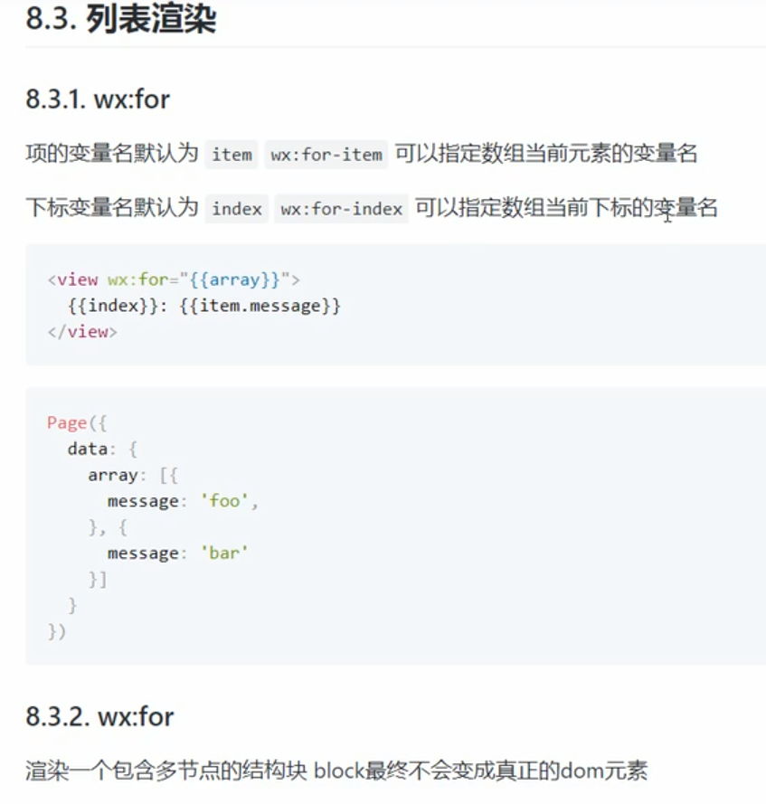
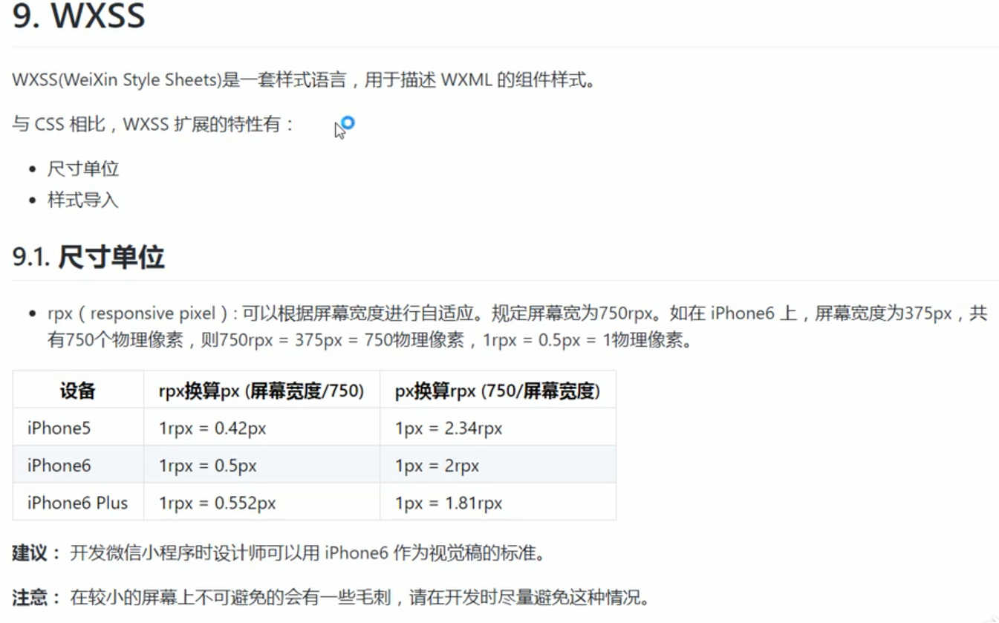
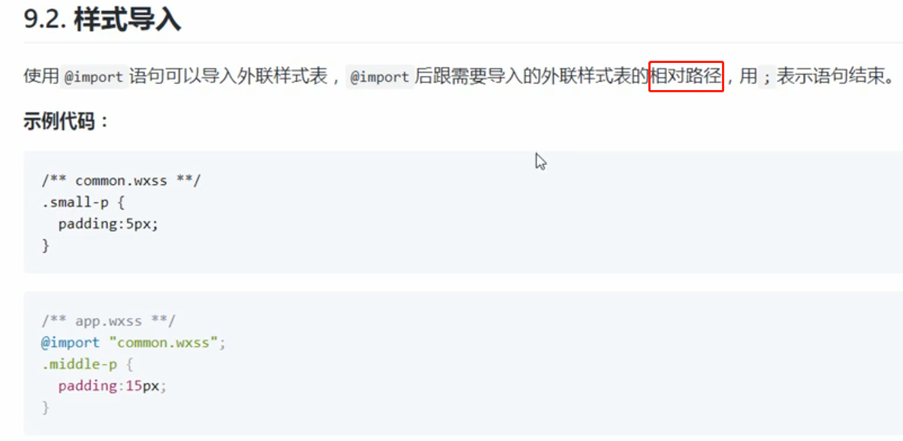
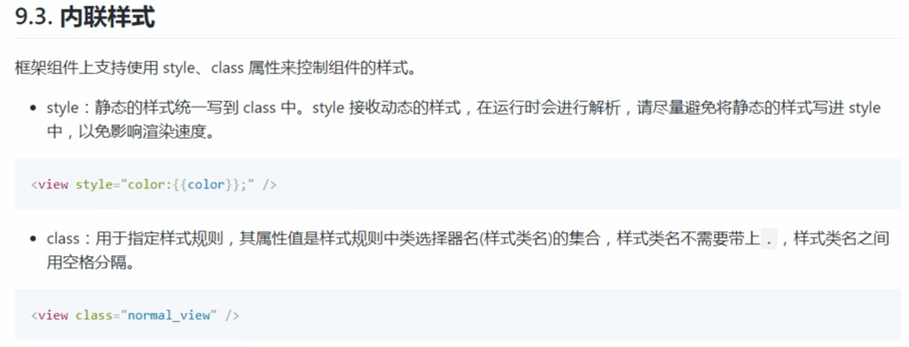
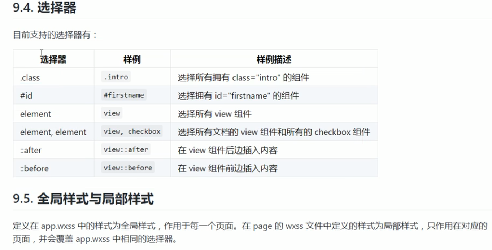
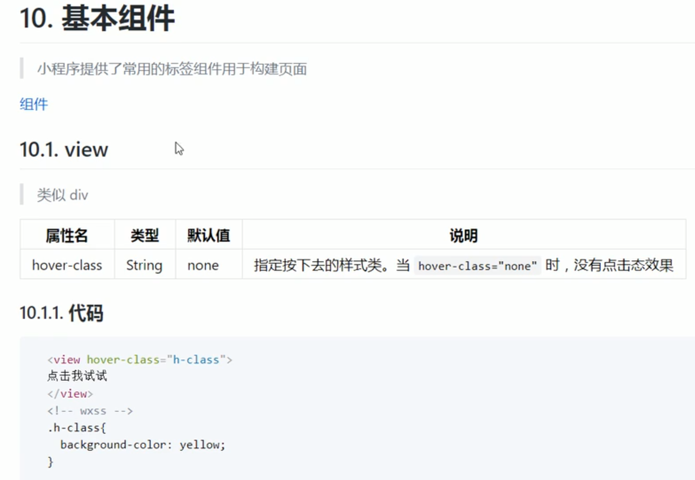

# 微信小程序

## 变量的定义：在页面的js文件中的data中用key：value的形式定义
## 变量的使用：{{变量名}}

### 如上图，data里面的变量定义，除了最后一个不需要用“，”隔开，其他都需要用“，”隔开，"aaa"表示字符串
### false和true两个值属于boolean类型，不需要加""，否则会被识别为字符串！
### wxml中的view标签相当于html中的div标签

## WXSS

## 基本组件

